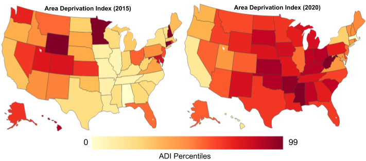
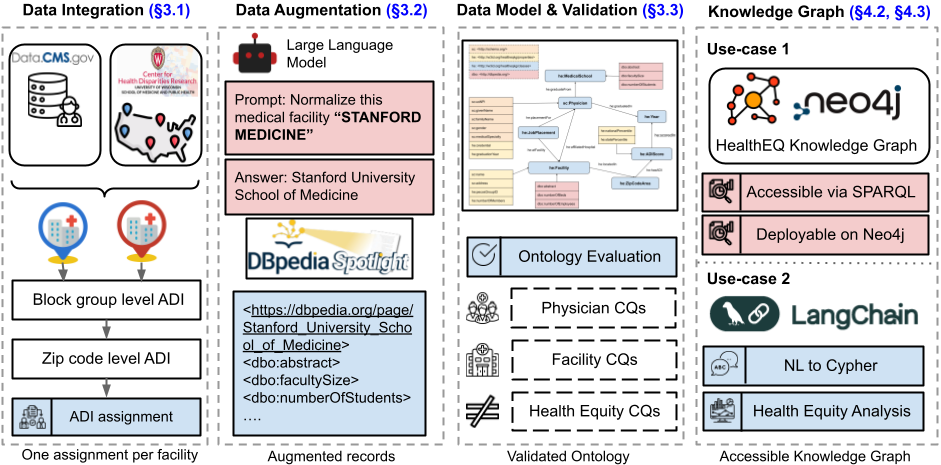

# Health Equity Knowledge Graph (HealthEQKG)

[](https://creativecommons.org/licenses/by/4.0/)

HealthEQKG is a comprehensive knowledge graph linking *physicians*, *healthcare facilities*, *medical schools*, and *Area Deprivation Index (ADI)* scores for research into health equity. It includes:

* **Physician data** (NPI, specialty, graduation year, credentials)
* **Facility data** (location, Medicare ID, descriptive metadata)
* **Medical school** (including DBpedia abstract, faculty & student counts)
* **ADI scores** per ZIP code



This repository explains:

1. **Data‑processing** to generate Turtle (`.ttl`) and Gzip‑compressed (`.ttl.gz`) files from CSV sources, with full ontology declarations (.owl).
2. **Ontology extraction** script to produce a standalone OWL/RDF‑XML file.
3. **Deployment instructions** for a Dockerized Virtuoso SPARQL endpoint on Google Cloud (free tier).
4. **Guides** for updating the endpoint via the web UI or ISQL.



---

## Table of Contents

* [Prerequisites](#prerequisites)
* [Data Processing](#data-processing)
* [Ontology Extraction](#ontology-extraction)
* [RDF Namespaces](#rdf-namespaces)
* [Deploying Virtuoso on Google Cloud (UI)](#deploying-virtuoso-on-google-cloud-ui)
* [Updating the SPARQL Endpoint](#updating-the-sparql-endpoint)
* [License](#license)

---

## Prerequisites

* **Python >= 3.8** with packages: `pandas`, `rdflib`, `rapidfuzz`, `tqdm`
* **Local VM environment** or **Google Cloud account**
* **Docker** installed on the VM

---

## Data Processing

### 1. Build the full RDF graph

```bash
python healtheqkg_builder_with_ontology.py
```

This script:

* Reads the three CSVs and expands ADI for years 2015–2020
* Normalizes state codes → full names with `rdfs:label`
* Performs fuzzy matching on medical school names
* Generates `healtheqkg_full.ttl` (Turtle) with embedded ontology triples
* Generates `healtheqkg_full.ttl.gz` (compressed) for bulk loading

**Outputs:**

* `healtheqkg_full.ttl`
* `healtheqkg_full.ttl.gz`

---

## Ontology Extraction

Extract a standalone OWL/RDF‑XML file for evaluation tools (Protégé, OOPS!):

```bash
python extract_ontology_from_full_graph.py
```

Produces:

* `healtheqkg_ontology.owl`

Includes:

* `owl:Ontology` declaration, license, labels, comments
* `owl:Class` and `rdf:Property` declarations
* Disjointness axioms

---

## RDF Namespaces

```ttl
PREFIX he:     <http://healtheqkg.example.org/ontology#>
PREFIX schema: <http://schema.org/>
PREFIX dbo:    <http://dbpedia.org/>
PREFIX xsd:    <http://www.w3.org/2001/XMLSchema#>
PREFIX rdf:    <http://www.w3.org/1999/02/22-rdf-syntax-ns#>
PREFIX rdfs:   <http://www.w3.org/2000/01/rdf-schema#>
PREFIX owl:    <http://www.w3.org/2002/07/owl#>
```
Use these prefixes in SPARQL queries against the graph.
---

## Deploying Virtuoso on Google Cloud

### Step 1: Create VM

1. **Compute Engine ▸ VM instances ▸ Create Instance**
2. Name: `virtuoso-sparql`
   Machine: **e2‑micro**, Ubuntu 22.04 LTS, 10 GB disk
   Allow HTTP traffic

### Step 2: Launch browser‑SSH

1. In **VM instances** list, click **SSH**
2. At `ubuntu@…$` prompt:

   ```bash
   sudo apt update && sudo apt install -y docker.io
   sudo systemctl enable --now docker
   mkdir ~/virtuoso_db
   ```

### Step 3: Run Virtuoso

```bash
sudo docker run -d --name virtuoso \
  --restart unless-stopped \
  -p 80:8890 \
  -v ~/virtuoso_db:/data \
  -e DBA_PASSWORD='YourDBAPassword' \
  openlink/virtuoso-opensource-7
```

* Conductor UI: `http://<VM_IP>/conductor` (dba/YourDBAPassword)
* SPARQL endpoint: `http://<VM_IP>/sparql`

### Step 4: Upload and load TTL

1. In Conductor, **Linked Data ▸ Import RDF**

   * **WebDAV Upload**: browse & upload `healtheqkg_full.ttl.gz`
   * **Load from Server**: select `/DAV/healtheqkg_full.ttl.gz`
     Graph IRI = `http://healtheqkg.example.org/graphs/schema`
   * Click **Load**
2. Monitor **Status** until **done**
3. Verify in **Linked Data ▸ SPARQL**:

   ```sparql
   SELECT (COUNT(*) AS ?c) WHERE { GRAPH <http://healtheqkg.example.org/graphs/schema> { ?s ?p ?o } }
   ```

---

## Updating the SPARQL Endpoint

**Via UI (Conductor):**

1. **Linked Data ▸ SPARQL** (Update checkbox)
   `CLEAR GRAPH <http://healtheqkg.example.org/graphs/schema> ;`
   **Execute**
2. **Import RDF ▸ Load from Server** → select new `.ttl.gz` → **Load**

**Via CLI (ISQL):**

```bash
sudo docker exec -it virtuoso isql 1111 dba YourDBAPassword
```

```sql
SPARQL CLEAR GRAPH <http://healtheqkg.example.org/graphs/schema> ;
ld_dir('/data','healtheqkg_full.ttl.gz','http://healtheqkg.example.org/graphs/schema');
rdf_loader_run();
checkpoint;
quit;
```


---

## License

This work is licensed under [CC BY 4.0](https://creativecommons.org/licenses/by/4.0/).

---

## Contact

For questions or issues, please contact: **[nananuku@usc.edu](mailto:nananuku@usc.edu)**
