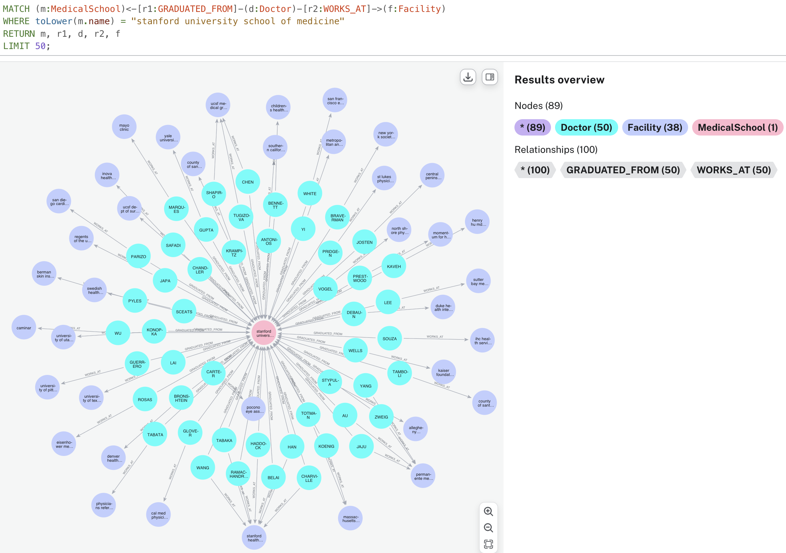
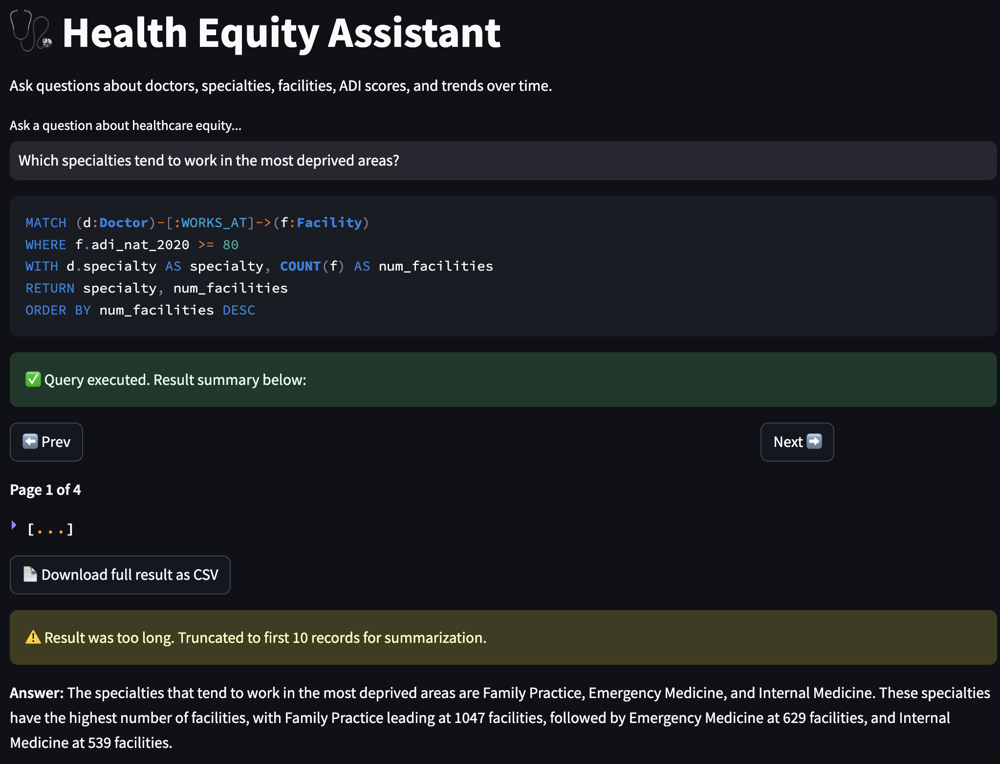

# Health Equity Knowledge Graph (HealthEQKG)

[](https://creativecommons.org/licenses/by/4.0/)

HealthEQKG is a comprehensive knowledge graph linking *physicians*, *healthcare facilities*, *medical schools*, and *Area Deprivation Index (ADI)* scores for research into health equity. It includes:

* **Physician data** (NPI, specialty, graduation year, credentials)
* **Facility data** (location, Medicare ID, descriptive metadata)
* **Medical school** (including DBpedia abstract, faculty & student counts)
* **ADI scores** per ZIP code


This repository explains:

1. **Data‑processing** to generate Turtle (`.ttl`) and Gzip‑compressed (`.ttl.gz`) files from CSV sources, with full ontology declarations (.owl).
2. **Ontology extraction** script to produce a standalone OWL/RDF‑XML file.
3. **Deployment instructions** for a Dockerized Virtuoso SPARQL endpoint on Google Cloud (free tier).
4. **Guides** for updating the endpoint via the web UI or ISQL.


---

## Table of Contents

* [Prerequisites](#prerequisites)
* [Data Processing](#data-processing)
* [Ontology Extraction](#ontology-extraction)
* [RDF Namespaces](#rdf-namespaces)
* [Deploying Virtuoso on Google Cloud (UI)](#deploying-virtuoso-on-google-cloud-ui)
* [Updating the SPARQL Endpoint](#updating-the-sparql-endpoint)
* [License](#license)

---

## Prerequisites

* **Python >= 3.8** with packages: `pandas`, `rdflib`, `rapidfuzz`, `tqdm`
* **Local VM environment** or **Google Cloud account**
* **Docker** installed on the VM

---

## Data Processing

### Download Raw Data from Zenodo

Due to GitHub size constraints, the full raw datasets and preprocessing notebooks are archived on (DOI: [<Zenodo>](https://zenodo.org/records/15708535)). Download and unzip the resource bundle:

```bash
wget -O HealthEQKG-resource.zip "https://zenodo.org/records/15708535/"
unzip HealthEQKG-resource.zip -d HealthEQKG-resource
```

This archive includes:

* `HealthEQKG-resource/resource-neo4j_import-v2.csv` — original CSVs and supporting files
* `HealthEQKG-resource/notebooks/raw-data-rdf-neo4j/` containing two Jupyter notebooks:
  - **healtheqkg_rdf_upload.ipynb**: preprocess CSVs and build Turtle files
  - **neo4j_instance_connection_upload.ipynb**: load data into a Neo4j Aura Free instance

---

### 1. Build the Full RDF Graph

Use the **healtheqkg_rdf_upload.ipynb** notebook to generate your RDF:

1. Start Jupyter in the repository root:
   ```bash
   jupyter notebook HealthEQKG-resource/notebooks/raw-data-rdf-neo4j/healtheqkg_rdf_upload.ipynb
   ```
2. In the notebook, run all cells. It will:
   * Read and clean CSVs from `HealthEQKG-resource`
   * Normalize state names with `rdfs:label`
   * Perform fuzzy matching on medical school names against DBpedia
   * Expand ADI values for 2015–2020
   * Output:
     - `healtheqkg_full.ttl` (Turtle)
     - `healtheqkg_full.ttl.gz` (compressed for bulk upload)

Alternatively, you can run the builder script directly:

```bash
python healtheqkg_builder_with_ontology.py
```

**Outputs:**

* `healtheqkg_full.ttl`
* `healtheqkg_full.ttl.gz`

---

### 2. Build Neo4j Graph Instances

Use the **neo4j_instance_connection_upload.ipynb** notebook to load into Neo4j:

1. Provision a Neo4j Aura Free instance URI and auth token.
2. Start Jupyter:
   ```bash
   jupyter notebook HealthEQKG-resource/notebooks/raw-data-rdf-neo4j/neo4j_instance_connection_upload.ipynb
   ```
3. In the first cell, enter your Neo4j connection details.
4. Run all cells to:
   * Preprocess the same CSVs from `HealthEQKG-resource/raw-data/`
   * Create nodes and relationships for physicians, facilities, schools, zip areas, ADI scores, and job placements

**Outputs:**

* A populated Neo4j graph instance accessible via the Aura console
* `healtheqkg_full.ttl` remains available for SPARQL endpoint loading

---

## Ontology Extraction

The ontology, which defines schemas for physicians, facilities, schools, ADI, and placements, was designed **before** the implementation.


Extract a standalone OWL/RDF‑XML file for evaluation tools (Protégé, OOPS!): HealthEQKG-resource/notebooks/extract_ontology_from_graph.py


Produces:

* `healtheqkg_ontology.owl`

Includes:

* `owl:Ontology` declaration, license, labels, comments
* `owl:Class` and `rdf:Property` declarations
* Disjointness axioms

---

## RDF Namespaces

```ttl
PREFIX he:     <http://healtheqkg.example.org/ontology#>
PREFIX schema: <http://schema.org/>
PREFIX dbo:    <http://dbpedia.org/>
PREFIX xsd:    <http://www.w3.org/2001/XMLSchema#>
PREFIX rdf:    <http://www.w3.org/1999/02/22-rdf-syntax-ns#>
PREFIX rdfs:   <http://www.w3.org/2000/01/rdf-schema#>
PREFIX owl:    <http://www.w3.org/2002/07/owl#>
```

Use these prefixes in SPARQL queries against the graph.

---

## Deploying Virtuoso on Google Cloud

### Step 1: Create VM

1. **Compute Engine ▸ VM instances ▸ Create Instance**
2. Name: `virtuoso-sparql`
   Machine: **e2‑micro**, Ubuntu 22.04 LTS, 10 GB disk
   Allow HTTP traffic

### Step 2: Launch browser‑SSH

1. In **VM instances** list, click **SSH**
2. At `ubuntu@…$` prompt:

   ```bash
   sudo apt update && sudo apt install -y docker.io
   sudo systemctl enable --now docker
   mkdir ~/virtuoso_db
   ```

### Step 3: Run Virtuoso

```bash
sudo docker run -d --name virtuoso \
  --restart unless-stopped \
  -p 80:8890 \
  -v ~/virtuoso_db:/data \
  -e DBA_PASSWORD='YourDBAPassword' \
  openlink/virtuoso-opensource-7
```

* Conductor UI: `http://<VM_IP>/conductor` (dba/YourDBAPassword)
* SPARQL endpoint: `http://<VM_IP>/sparql`

### Step 4: Upload and load TTL

1. In Conductor, **Linked Data ▸ Import RDF**

   * **WebDAV Upload**: browse & upload `healtheqkg_full.ttl.gz`
   * **Load from Server**: select `/DAV/healtheqkg_full.ttl.gz`
     Graph IRI = `http://healtheqkg.example.org/graphs/schema`
   * Click **Load**
2. Monitor **Status** until **done**
3. Verify in **Linked Data ▸ SPARQL**:

   ```sparql
   SELECT (COUNT(*) AS ?c) WHERE { GRAPH <http://healtheqkg.example.org/graphs/schema> { ?s ?p ?o } }
   ```

---

## Updating the SPARQL Endpoint

**Via UI (Conductor):**

1. **Linked Data ▸ SPARQL** (Update checkbox)
   `CLEAR GRAPH <http://healtheqkg.example.org/graphs/schema> ;`
   **Execute**
2. **Import RDF ▸ Load from Server** → select new `.ttl.gz` → **Load**

**Via CLI (ISQL):**

```bash
sudo docker exec -it virtuoso isql 1111 dba YourDBAPassword
```

```sql
SPARQL CLEAR GRAPH <http://healtheqkg.example.org/graphs/schema> ;
ld_dir('/data','healtheqkg_full.ttl.gz','http://healtheqkg.example.org/graphs/schema');
rdf_loader_run();
checkpoint;
quit;
```

---

## Querying the SPARQL Endpoint

HealthEQKG provides a web‑based SPARQL query interface for exploring the data—no coding required.

**Endpoint URL:**
```
http://healtheqkg.myftp.org/sparql
```

### 1. Access the Query UI
1. Open your web browser and navigate to the endpoint URL above.
2. You will see:
   - A **Query** text box where you enter SPARQL queries.
   - An **Execute** button to run your query.
   - A **Results** pane below that displays returned rows.

### 2. Declare Prefixes (Namespaces)
At the top of each query, declare the vocabularies (namespaces) you will use. For example:
```sparql
PREFIX schema: <http://schema.org/>
PREFIX he:     <http://healtheqkg.example.org/ontology#>
```
- **schema:** refers to Schema.org classes and properties (e.g., `schema:Physician`).
- **he:** refers to HealthEQKG’s ontology (e.g., `he:JobPlacement`, `he:hasParticipant`).

### 3. Example Query: Cardiology Facilities in 2020
Paste the following into the Query box, then click **Execute**:
```sparql
PREFIX schema: <http://schema.org/>
PREFIX he:     <http://healtheqkg.example.org/ontology#>

SELECT DISTINCT ?fac
WHERE {
  # Find all Physicians whose specialty contains "cardio"
  ?p a schema:Physician ;
     schema:medicalSpecialty ?spec .
  FILTER(CONTAINS(LCASE(STR(?spec)), "cardio"))

  # Follow JobPlacement in 2020 to their Facility
  ?jp a he:JobPlacement ;
      he:hasParticipant   ?p ;
      he:worksAt          ?fac ;
      he:hasTimeReference ?yr .
  FILTER(STRAFTER(STR(?yr), "/year/") = "2020")
}
```
**What it does:**
1. Uses the `schema:` and `he:` prefixes to reference classes and properties.
2. Finds all physicians (`schema:Physician`) with specialties matching “cardio.”
3. Traverses `he:JobPlacement` relationships in year 2020 to identify distinct facility nodes (`?fac`).

### 4. Interpret the Results
- The **Results** pane will list one column, `fac`, containing the IRIs of each facility.
- You can click each IRI (if dereferenceable) or copy-paste it into subsequent queries.

### 5. Next Steps
- Modify the **SELECT** clause to return additional fields (e.g., facility name, address).
- Explore other prefixes from the [RDF Namespaces](#rdf-namespaces) section.

---

## Natural Language Interface & Neo4j Visualization

To demonstrate end-to-end capabilities using NL to Cypher pipeline, we provide notebooks for loading neo4j instance and perform agentic querying processes.




1. **Load LLM & Prompt (01_load_llm_prompt.ipynb):**  
   - Configure and authenticate OpenAI’s GPT-4o-mini.  
   - Define few-shot prompts to map user questions to intended queries.

2. **Query Neo4j (02_query_neo4j.ipynb):**  
   - Connect to your Neo4j Aura Free instance.  
   - Parse natural language questions through LangChain.  
   - Generate Cypher queries dynamically.

3. **Summarize Results (03_summarize_results.ipynb):**  
   - Execute Cypher queries against Neo4j.  
   - Aggregate and format results for human consumption.

4. **End-to-End Pipeline (04_end_to_end_pipeline.ipynb):**  
   - Combines all steps: LLM prompting → Cypher generation → query execution → result summarization.  
   - Demonstrates a seamless chat-based interface.

Future work includes integrating a web-based chatbot interface:



Feel free to explore these notebooks in `notebooks/` for detailed walkthroughs.

---

## Reproducibility & Raw Data

Due to GitHub size constraints, the full raw datasets and processing notebooks are archived on **[<Zenodo>](https://zenodo.org/records/15708535)**. This provides a persistent DOI and ensures all artifacts (CSV sources, Jupyter notebooks, scripts) are available for complete reproduction.  

---

## Configuration Details


### DBpedia Spotlight
We used DBpedia Spotlight with **confidence=0.8** and **support=20** for entity linking.

### LLM Usage
We utilized OpenAI’s **GPT-4o-mini** (no fine‑tuning) for fuzzy matching of place names. Few‑shot prompts included exemplar DBpedia names.  
Total prompt costs: Input ≈ 2.04 M tokens ($2.24), Output ≈ 438 K tokens ($1.93), **Total ≈ $4.17**.

### Scalability
The full HealthEQKG (∼198 k nodes, ∼319 k edges) runs on free-tier Google Cloud Virtuoso and Neo4j Aura without performance issues.

### Persistent Access and Maintenance
A permanent archive is available on ([<Zenodo>](https://zenodo.org/records/15708535)). All URIs will be made dereferenceable via server-side configuration in future releases, ensuring stable access.

### SPARQL Access Tutorial
An example SPARQL tutorial, including query samples and figures, is provided in the **queries/** folder and as a Jupyter notebook in **notebooks/**.


---

## License

This work is licensed under [CC BY 4.0](https://creativecommons.org/licenses/by/4.0/).

---

## Contact

For questions or issues, please contact: **[nananuku@usc.edu](mailto:nananuku@usc.edu)**
